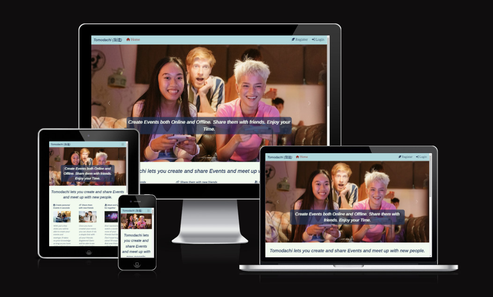
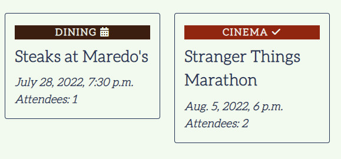
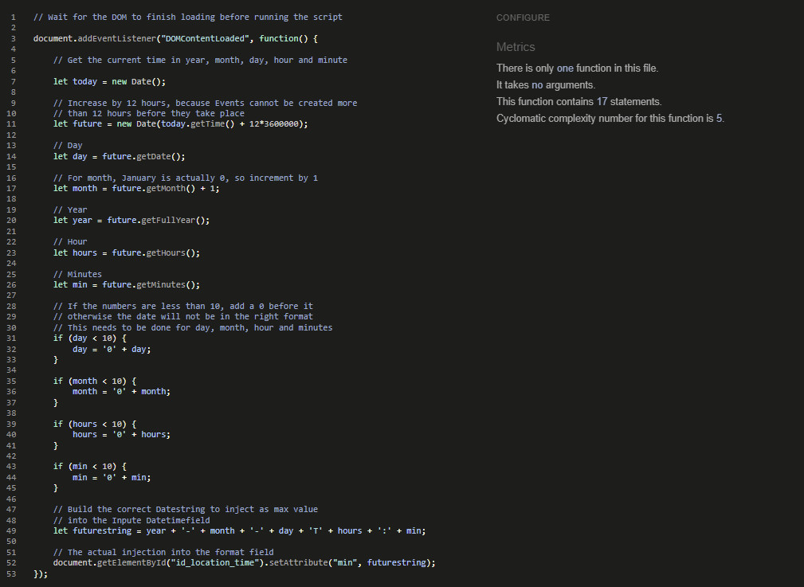

<h1 align="center"><a name="top">Project Tomodachi</a></h1>

[View the live project here.](https://portfolio-project-4-tomodachi.herokuapp.com/)

Project Tomodachi is a Website that allows you to create Events and share them with other people. Authenticated users can create events, update them, delete them and join events created by other people.

They are also able to browse all events available on the webpage to find one they like and want to take part in.

<h2 align="center"></h2>

 

## <a name="tableofcontents">Table of Contents</a>

### I. [User Experience (UX)](#userxp)
-   [Five Planes of UXD](#fiveplanes)
-   [Design](#design)
-   [User Stories](#userstories)
-   [Wireframes](#wireframes)

### II. [The Model](#databasemodel)

### III. [Features](#features)

### IV. [Technologies Used](#technology)

### V. [Testing](#testing)

### VI. [Deployment](#deployment)

### VII. [Credits](#credits)

  

## ([^](#tableofcontents)) <a name="userxp">User Experience (UX)</a>

## <a name="userxp">User Experience (UX)]</a>

*   ### <a name="fiveplanes">Five Planes of UXD</a>
    -   #### Strategy Plane
        1. The Strategy for this Site is mostly Personal, mainly to pass the Portfolio 4 Project. I want to do this by creating a Website that lets multiple people create and share Events and meetups to better organize themselves. 
        2. I've had this idea for a while now, mainly because I and my friends have been looking for something easier to organize than making calendar events and sending invitations that way. There are probably some apps out there that do the same thing, but I wanted my version which I can work on even after I finish the project.
        3. Expandability: Frameworks give plenty of options to expand the idea in the future. This version is more of a starting point than the end of the journey.
        

    -   #### Scope Plane
        1. The Site covers Authentication and CRUD around the Events as well as flagging an event for attendance.
        2. Actions done by the User like logging in or out will trigger Feedback Messages.
        3. The same is true for creating, deleting, modifying, and joining/leaving an Event.
        4. The Page 'My Events' is there to keep track of Events created by the User and Events he has joined so far as well as having easy access to deleting or modifying them.
        5. 'Browse Event' is there to show created Events and filter them by category, if they are online/offline, and/or if the Title, Summary, or Location contains a certain text the User defines.

    -   #### Structure Plane
        1. The Structure of the Site is simple and mostly linear. Progressing is mostly done with just the click of a Button unless form Inputs are required. The site visitor can always click on the navbar Elements to quickly find or create events. Only when watching event details or modifying an event, an additional step is needed.
        2. There is a clear indication on the Navbar when you are on one of it mentioned Pages. The only exceptions are 'detail' and 'modify' event pages because these require a specific event ID. However, these are straightforward and the site visitor can return to the normal navigation simply by clicking on one of the navbar elements.
    
    -   #### Skeleton Plane
        1. The [Wireframes](#wireframes) can be found further down in this Document.
        2. The Home Page is presented with a carousel, alternating images, and some basic information that gets the visitor interested. Further down more images with more pieces of information are implemented, finishing with a small list of upcoming events and a signup Button (only visible if the Site visitor is not already logged in). The Home Page is also the only site that contains images, while the other sites focus on Information display only.
        3. Events are implemented as Cards throughout the whole page, being introduced on the Home Page and then followed up in My Events and Browse.
        4. Forms are used for creating and modifying events as well as Filtering them in the Browse section on the Page. Crispy forms are used to make them fit with the Design of the Site.
        5. On mobile devices, the amount of content displayed next to each other changes to give users the chance to use the page with 100% functionality on these devices as well. The content is then ordered in a way he would normally consume the content on a Desktop Browser as well, to not cause confusion and keep it well structured. This is achieved by using Bootstrap 5.

    -   #### Surface Plane
        1. Fontawesome was used for the navbar, footer links, and event cards to display if you are the creator of that event or have joined it. Comparable Icons are used on other sites so this should feel familiar to the visitor.
        2. Further details like Font/Color choice, etc. can be found in the next separate Section: [Design](#design).

 

*   ### <a name="design">Design</a>
  
    -   #### Colour Scheme
        -   I choose a blueish color palette with a flashy red for highlighting links that are not buttons. The Palette can be found [here](https://coolors.co/9f141f-f1faee-a8dadc-457b9d-1d3557). The Font Color used is a Prussian Blue (#1D3557) while the background is not a clean white, but a variation of it called Honeydew (#F1FAEE). For the navbar, Powder Blue was my choice (#A8DADC) so that the contrast to both the Font Color as well as the Link Highlight in Ruby Red (#9F141F) meets WCAG compliance. The Footer swaps the colors around, taking the Site's Font color as its background and the Background color as its font color.
        -   To round up the color usage, the remaining blue color of the palette is a Celadon Blue (#457B9D), which is between the Prussian Blue of the font and the Powder Blue of the navbar, is used for the buttons on the website, the only exception being the reset button on the webform for creating an event to have some visual distinction there.
    
     
    <h2></h2> 

    -   #### Typography
        -   The Aleo font is used as the main font for the whole website with a serif as a backup font in case the font doesn't import correctly. It is also displayed in italic and bold, which makes it easy to read on all devices.
        -   To complement this, Arimo is used as the main header font. Its main purpose is to support the site's theme. The backup font is sans-serif.
  
    -   #### Imagery
        -   Only the Home Page contains any imagery. There is a big carousel showing multiple people taking part in events to associate the Site with the end goal of having fun together with other people. Further down the Homepage, we see 3 more images that show people creating and sharing an event, as well as one picture of a big event taking part at night with lots of lighting.
        
  
 

*   ### <a name="userstories">User stories</a>

    - User Stories have been created in the Github Project and can be found [here](https://github.com/Mycrosys/portfolio-project-4-tomodachi/issues?q=is%3Aissue).

 

*   ### <a name="wireframes">Wireframes</a>
    -   Index Page Wireframe 1
        <h2></h2> 
    -   Index Page Wireframe 2
        <h2></h2> 
    -   Index Page Wireframe 3
        <h2></h2> 
    -   Register Account Wireframe
        <h2></h2> 
    -   Sign In Wireframe
        <h2></h2> 
    -   Sign Out Wireframe
        <h2></h2> 
    -   My Events Wireframe
        <h2></h2> 
    -   My Events Wireframe Mobile
        <h2></h2> 
    -   Delete Confirmation in My Events Wireframe
        <h2></h2> 
    -   Create Event Wireframe
        <h2></h2> 
    -   Browse Event Wireframe
        <h2></h2> 
    
  

## ([^](#tableofcontents)) <a name="databasemodel">The Database Model</a>

<h2></h2> 

- I decided on a simple Model for my first project to get it started. Allauth handles all Authentication Issues while my Event Model contains all relevant information about an event.

- Title, Summary, and Location_Area are Charfield/Textfields and are the most important Fields for a User to describe their Event. The Title will be visible on all cards throughout the Webpage, while the Summary and Location_Area can only be viewed on the Details Page. The summary contains the main event Description while Location_Area contains the meetup place, which can either be a physical address, or a link to another website, video service, or tool used.

- Location_Online tracks if the Event is an Offline Event (False), with people having to physically attend said event, or an Online Event (True), in which case people meet up on websites, voice, or video services, and the like. This is also only shown on the Detail Page, however, people can filter these Events on the Browse Page if they are looking specifically for one or the other.

- Created_On, Modified_On, and Location_Time are DateTimeFields. While Created on automatically tracks the creation time of the event, Modified_On tracks the time of the last modification. Both of them are only visible on the Details Page. Location_Time however is visible in all cards, because it tracks the time the event is taking place and is the most important information out of the three in most cases.

- Category tracks the category of the Event. There are currently 5 Possible categories: DIN (Dining), CIN (Cinema), GAM (Gaming), SPO (Sports), and CAM (Camping). For this first version of the Page, these categories are Hardcoded and limited to five, however, this is a place to further improve on the project, having a separate category model that lets the admin add new categories on the fly in another iteration of the Development cycle. The category is a piece of very important information for a Site User and every Card immediately shows its Category with a color Coded Background at the top of it.

- Author and Attendees track the Creator of the Event as well as the people that have joined it, confirming their attendance. The Author is shown on the Details Page, while the number of attendees is shown on every card, to see how popular a said event is. The Usernames of the people that joined are not shown anywhere on the normal page. Only the Admin will have access to this information on the admin panel due to possible privacy concerns. We don't want people to be stalked, so I limited the display for the moment. A future iteration may introduce both the display of users to the event creator, as well as granting the event creator the right to remove Attendees from their event.

- An earlier version used a slug, created from the title, but that was proven as being not effective because titles are probably being reused a lot in this scenario. Instead, the Event ID is now being used to link up pages.

  

## ([^](#tableofcontents)) <a name="features">Features</a>

###   Authentication

- Allauth handles all Authentication on the Website. Most of the Pages (details, my events, create/modify events, browse) require the User to be authenticated to work. If the User is not Authenticated, many elements of the Website aren't available, e.g. the Navbar does not even show some Pages, to begin with. If a User however uses a valid link to enter one of these pages, he will be met with a message telling him that he needs to be logged in and redirected to the home page a couple of seconds later. On the other side, if a user is authenticated, other elements are not shown. For example, neither the Login nor Register button is available, but instead, a logout option, as well as the username, is displayed. Likewise, the signup button on the bottom of the index page vanishes, if the user is logged in.

The Navbar with a logged in User.
<h2></h2> 
Message telling you to log in or register.
<h2></h2> 

###   Color Coded display of Events, Information Icons

- Events are shown as Cards on the Website, with their Category having a unique background color to make it immediately recognizable which kind of Event the Site User is looking at. In addition, as a logged-in User, these cards do contain symbols showing if you are the creator of the event (A Calendar Icon will appear) or have confirmed your attendance for that Event already (A checkmark Icon will be shown). Both are implemented via Fontawesome.

<h2></h2> 

###   Event Creation/Modification and Deletion

- Registered Site Users can create their own events as well as modify or delete them. For easier access to created events, my events page exists, showing all events that the user created and have not already taken place (expired events are not shown anywhere on the page). In case of a deletion of an Event, a confirmation modal is being shown that asks for confirmation. Deleting an Event has non-reversible repercussions because while you may be able to create the event again, all attendees need to join that new event again by themselves. If you want your Event to keep its attendees, modifying instead of deleting and recreating it is recommended.

<h2></h2> 

- Event Creation and Modification are limited to give people time to adjust to attend or adjust to the changes. An event needs to be created at least 12 hours before it is taking place. The same holds true if you want to modify an event. In case the starting time is closer than 12 hours, you will be prompted to update the Location_Time when modifying your event.

<h2></h2> 

###   Joining or Leaving Events and tracking of Attendees

- Registered Site Users are able to show their attendance by joining an Event. They can also leave it at any time, with no restrictions set in place. At this time, their name will not be visible to anyone except the admin in the admin panel for privacy reasons. This may change in future iterations of the project to give more control to the Event creator to manage the attendees.

- Event Creators can not join or leave their created events. Their attendance is required and they are added as an attendee upon creation of the event. In order for them to leave their event, they will need to delete it completely. This is so Event Creators take ownership of their events and not create them and let attendees handle everything around them.

<h2></h2> 

###   Visual Feedback to User Actions

- The Site gives Users visual Feedback on where they are and if their mouse is over a link that will cause an action like submitting a form, resetting it, filtering events, or changing the site they currently are on. In addition, actions like logging in, logging out, deleting/modifying an event or joining, or leaving it, will create a feedback message that will be shown for a couple of seconds on top of the screen.

Hovering over the Delete Button with the mouse. 
<h2></h2> 
Hovering over the Browse Navbar Link with the mouse while on the My Events Page. 
<h2></h2> 
Confirmation message after modifying an event. 
<h2></h2> 
 

## ([^](#tableofcontents)) <a name="technology">Technologies Used</a>

### Languages Used

-   [HTML 5](https://en.wikipedia.org/wiki/HTML/)
-   [CSS 3](https://en.wikipedia.org/wiki/CSS)
-   [JavaScript](https://de.wikipedia.org/wiki/JavaScript)
-   [Python](https://en.wikipedia.org/wiki/Python_(programming_language))
-   [Django](https://de.wikipedia.org/wiki/Django_(Framework))

### Django Packages Used

1. [Dj_database_url](https://pypi.org/project/dj-database-url/)
    - For parsing the URL from env.py
1. [Psycopg2](https://pypi.org/project/psycopg2/)
    - As a PostgreSQL database adapter for the Python
1. [Gunicorn](https://gunicorn.org/)
    - As the Heroku Server
1. [Allauth](https://django-allauth.readthedocs.io/en/latest/installation.html)
    - For Authentication (Signup, Login, Logout)
1. [Summernote](https://summernote.org/)
    - For the Filtering and WYSIWYG Editor in the Admin Panel
1. [Cloudinary](https://cloudinary.com/)
    - As a host for static and media files
1. [Crispy Forms](https://django-crispy-forms.readthedocs.io/en/latest/)
    - For styling login, register, create an event, modify an event and browse filter forms

### Frameworks, Libraries & Programs Used

1. [Code Institute Basic Template:](https://github.com/Code-Institute-Org/gitpod-full-template)
    - This Template was used as a requirement for this Project.
1. [Git](https://git-scm.com/)
    - Git was used for version control by utilizing the Gitpod terminal to commit to Git and Push to GitHub.
1. [GitHub:](https://github.com/)
    - GitHub is used to store the project's code after being pushed from Git.
1. [Google Fonts:](https://fonts.google.com/)
    - Google fonts were used to import the 'Aleo' and 'Arimo' fonts into the style.css file.
1. [Font Awesome:](https://fontawesome.com/)
    - Font Awesome was used to add icons for aesthetic and UX purposes.
1. [Bootstrap](https://getbootstrap.com/)
    - Used to make the Website responsive and style it.
1. [Jquery](https://jquery.com/)
    - To help with Javascript
1. [Heroku](https://www.heroku.com/)
    - For deployment of the Project
1. [PostgreSQL](https://www.postgresql.org/)
    - As the Database used for the project.
1. [Balsamiq](https://balsamiq.com/)
    - Balsamiq was used to create [Wireframes](#wireframes) for the project.
1. [Gimp:](https://www.gimp.org/)
    - Gimp was used to create, modify and resize all images on this website.
1. [Favicon Generator](https://favicon.io/favicon-generator/)
    - Favicon Generator was used to create the Favicon for the project.
1. [W3C - HTML](https://validator.w3.org/)
    - For validating the HTML code
1. [W3C - CSS](https://jigsaw.w3.org/css-validator/)
    - For validating the CSS Code
1. [JSHINT - JS](https://jshint.com/)
    - For validating the JS Code
1. [PEP8](http://pep8online.com/)
    - For validating the Python code
1. [a11y](https://color.a11y.com/Contrast/)
    - For validating contrast of colors used on the Website

 

## ([^](#tableofcontents)) <a name="testing">Testing</a>

### General Testing

1. The W3C Markup Validator and W3C CSS Validator Services were used to validate every page of the project to ensure there were no syntax errors in the project.
    - [W3C Markup Validator](https://validator.w3.org/#validate_by_input) - [Results](https://validator.w3.org/nu/?doc=https%3A%2F%2Fportfolio-project-4-tomodachi.herokuapp.com%2F)
    - Because most of the Websites Content was not available to test because it required validation, the Site Code (browser -> show source code)was instead put into the Markup Validator to confirm every site runs through it without error. No errors have been found and all Pages returned the same result as the home page.
    - [W3C CSS Validator](https://jigsaw.w3.org/css-validator/#validate_by_input) - [Results](https://jigsaw.w3.org/css-validator/validator?uri=https%3A%2F%2Fres.cloudinary.com%2Fmkiesel-cloudinary%2Fraw%2Fupload%2Fv1%2Fstatic%2Fcss%2Fstyle.effe9a6f455e.css&profile=css3svg&usermedium=all&warning=1&vextwarning=&lang=de)

2. The JSHINT Validator was used to validate the Javascript used on the place. There is only a single function used for setting the min Date in the create and modify event form. The 8 Warnings all relate to jshint settings ('let' is available in ES6 (use 'esversion: 6') or Mozilla JS extensions (use moz).) and can be safely ignored. All scripts not contained in that Javascript file were related to the carousel or messages and have been taken from the [Bootstrap 5 Documentation](https://getbootstrap.com/docs/5.0/getting-started/introduction/).
<h2></h2> 

3. PEP8 was used for the validation of the Python code. This is a huge part of the Project, spanning hundreds of lines, mostly in the automated tests and views.py, but all Python files were checked. There was no error reported in any of them.
<h2></h2> 

4. Contrast and WCAG: [a11y](https://color.a11y.com/Contrast/) was used to check for WCAG compliance to maximize Accessibility.
<h2></h2>     

5. Resolution and Scaling were tested with Google Dev tools down to the lowest width device (Galaxy Fold, 280px) to ensure the website works flawlessly on all resolutions 280px and above.

6. The Website was viewed on the following Devices:
    - Windows 10 PC
    - Google Pixel 6
    - Apple Ipad

Both the Pixel 6 displayed the site perfectly in normal and Landscape mode on Google Chrome. In addition, the Website was viewed on PC on Google Chrome, Mozilla Firefox, Opera Brave, and Microsoft Edge. The site looked and worked great on all Devices and all Browsers Used.
 

### Google Lighthouse Testing

1. Results
- Desktop of Index Page:
  <h2></h2> 
- Mobile of Index Page:
  <h2></h2> 
- Desktop of My Events Page:
  <h2></h2> 
- Mobile of My Events Page:
  <h2></h2> 
- Performance for the Index Page is low, due to its use of lots of Pictures. Performance is also decreased due to the use of lots of libraries, so not much can be done here. Even though the Performance here seems rough, especially on Mobile Devices, all Pictures combined amount to less than 1.5MB of Data, which should be manageable. The Performance also relies on how fast everything is served, and we are making use of Cloud Services for media and CDNs for libraries. Performance does however improve on the other pages, due to the lack of imagery hosted there (only the index site has any images at all). I choose the results of the My Events Page, because that is the Page where the most happen usually, the other pages receive similar results, however, with 1-2 points of margin.
- Accessibility and SEO receive perfect Marks on all Pages
- Best Practices receive a 92 on all Pages, with an Issue related to cookies and cloudinary being mentioned as the reason.
  <h2></h2> 

 

### Automated Testing (Django Testcase)

1. A total of 39 automatic tests were written to test the Forms, the Model, and the Views extensively. The Tests are as follows:
    - 9 Tests, checking if the Page is loading and the correct template is used
    - 2 Tests, if the Filter on the Browse Page returns the correct events
    - 3 Test, if you can modify an event (one as author, one as not being the author, and one with an invalid submission)
    - 2 Tests, if you can delete an event (one as author, and one with not being the author)
    - 2 Tests, if you can create an event (one with a valid submission and one with an invalid submission)
    - 2 Tests, if you can join an event (one with already being an attendee and one with previously not being one)
    - 2 Tests, if you can leave an event (one with being an attendee, one with not being a current attendee)
    - 1 Test, with checking if location_online in the model defaults to False
    - 1 Test, with checking if the string method in the model returns the title
    - 6 Tests, if specific Fields in a Form are required
    - 8 Tests, if specific Fields in a Form are not required
    - 1 Test, if the Form Fields in the Metaclass are explicit
2. The Tests are run by typing "python3 manage.py test" in the Terminal.
3. Results: <h2></h2>
4. Coverage: <h2></h2>
The remaining 2% is code that will never happen but has been implemented for best practice to catch invalid submissions like in all views. The submission in this specific case however has been coded to always create a valid result, so this code can not be covered with automatic testing.

 

## ([^](#tableofcontents)) <a name="deployment">Deployment</a>

## Creating a Django app

1. You will need to use the Code Institute Gitpod Full Template [Template](https://github.com/Code-Institute-Org/gitpod-full-template)
1. Click on the "Use This Template" Button, and once it is in your repository, click on Gitpod and way for the image to be finished.
1. Open a Terminal and install Django and gunicorn with "pip3 install 'django<4' gunicorn".
1. Then install the database libraries with "pip3 install dj_database_url psycopg2".
1. Next, create the requirements.txt with "pip2 freeze --local > requirements.txt".
1. You can then create the project with "django-admin startproject projectname" and create the app with "python3 manage.py startapp appname".
1. Add your created app to the list of installed apps in settings.py.
1. Migrate your changes with "python3 manage.py migrate", then Start your Server with "python3 manage.py runserver" and check if everything runs fine.
1. You should now see the basic deployment welcome page of Django.

## Deployment on Heroku

1. Log in to [Heroku](https://www.heroku.com)
1. When you see your Dashboard, click on "New" and select "Create New App"
1. Enter the App name and select your region then click on "Create App"
1. Click on "Resources" and add the Heroku Postgres database to your App
1. Next, click on "Settings" in the Top Nav and scroll down to "Config Vars". Click on "Reveal Config Vars"
1. Add the following Variables. "Port" with a value of "8000", "DISABLE_COLLECTSTATIC" with a value of "1" as well as the variables "SECRET_KEY", and "CLOUDINARY_URL" with the values matching your settings.py file. For that matter, it is important, that the DATABASE_URL in your Heroku Config Vars matches the one in your settings.py as well.
1. On the same page, scroll further down to "Buildpacks". Click on "Add buildpack" and add Python to it. Confirm by clicking "Save changes".
1. On the Top Nav now select "Deploy". Select Github as the deployment option and connect to your Github repository. Search for your repository name and click on the "connect" button.
1. At the bottom of the page, you will be able to choose between automatic and manual deployment. Choose your preferred method.

## Finalizing Deployment 

1. Create a Procfile with one line of content: "web: gunicorn project_name.wsgi".
1. Once your development is finished, go to the settings.py and change "DEBUG = TRUE" to "DEBUG = FALSE"
1. Add the following line of code to the same file: "X_FRAME_OPTIONS = SAMEORIGIN"
1. You can then delete the Config Var "DISABLE_COLLECTSTATIC = 1" in your Heroku App and push/deploy the final code.

### Forking the GitHub Repository

- By forking the GitHub Repository we make a copy of the original repository on our GitHub account to view and/or make changes without affecting the original repository by using the following steps:

1. Log in to GitHub and locate the [GitHub Repository](https://github.com/Mycrosys/portfolio-project-4-tomodachi)
1. At the top of the Repository (not top of the page) just above the "Settings" button on the menu, locate the "Fork" button.
1. You should now have a copy of the original repository in your GitHub account.

### Making a Local Clone

1. Log in to GitHub and locate the [GitHub Repository](https://github.com/Mycrosys/portfolio-project-4-tomodachi)
1. Under the repository name, click "Clone or download".
1. To clone the repository using HTTPS, under "Clone with HTTPS", copy the link.
1. Open Git Bash
1. Change the current working directory to the location where you want the cloned directory to be made.
1. Type "git clone", and then paste the URL you copied in Step 3.
1. Press Enter. Your local clone will be created.

Click [Here](https://help.github.com/en/github/creating-cloning-and-archiving-repositories/cloning-a-repository#cloning-a-repository-to-github-desktop) to retrieve pictures for some of the buttons and more detailed explanations of the above process.

 

## ([^](#tableofcontents)) <a name="credits">Credits</a>

### Framework

- The Template that was used in creating the Project belongs to [Code Institute](https://codeinstitute.net/global/) and can be found [here](https://github.com/Code-Institute-Org/gitpod-full-template).

### Readme

-   The Basic Structure of the Readme was taken from [Code Institute's Sample Readme](https://github.com/Code-Institute-Solutions/SampleREADME/blob/master/README.md).

### Media

- All Images used in this Project come from [pexels](https://www.pexels.com/) and are royalty-free.

- The [Carousel Cinema Image](https://www.pexels.com/photo/people-sitting-on-red-chairs-7991158/) was created by [Tima Miroshnichenko](https://www.pexels.com/@tima-miroshnichenko/).

- The [Carousel Gaming Image](https://www.pexels.com/photo/3-women-and-2-men-sitting-on-couch-8885104/) was created by [MART PRODUCTION](https://www.pexels.com/@mart-production/).

- The [Carousel Camping Image](https://www.pexels.com/photo/two-women-sitting-on-ground-near-bonfire-344102/) was created by [Oleksandr Pidvalnyi](https://www.pexels.com/@freestockpro/).

- The [Create Personal Events Image](https://www.pexels.com/photo/two-women-holding-laptop-1181273/) was created by [Christina Morillo](https://www.pexels.com/@divinetechygirl/).

- The [Share Events Image](https://www.pexels.com/photo/cheerful-black-man-showing-video-on-mobile-phone-to-friend-6140963/) was created by [William Fortunato](https://www.pexels.com/@william-fortunato/).

- The [Meet Events Image](https://www.pexels.com/photo/people-inside-concert-hall-2263436/) was created by [Teddy Yang](https://www.pexels.com/@teddy/).

- The Sites Favicon next to the Websites Name in the Tab was created with the [Favicon Generator](https://favicon.io/favicon-generator/).

### Acknowledgments

-   My Mentor for continuous helpful feedback.
-   Tutor Support for their help. Guys, you helped me big time in this project - many, many thanks to all of you. You're awesome!
-   My Peers in Code Institute's Slack channel for their feedback.