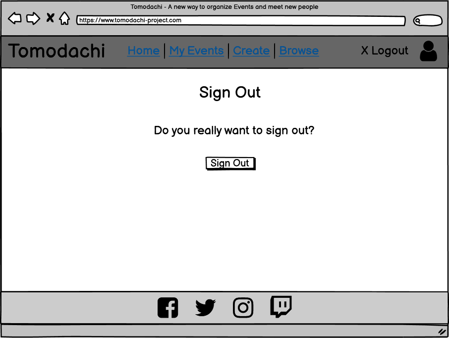

<h1 align="center"><a name="top">Project Tomodachi</a></h1>

[View the live project here.](https://portfolio-project-4-tomodachi.herokuapp.com/)

Project Tomodachi is a Website that allows you to create Events and share them with other people. Authenticated users can create events, update them, delete them and join events created by other people.

They are also able to browse all events available on the webpage to find one they like and want to take part in.

<h2 align="center"></h2>

 

## <a name="tableofcontents">Table of Contents</a>

### I. [User Experience (UX)](#userxp)
-   [Five Planes of UXD](#fiveplanes)
-   [Design](#design)
-   [User Stories](#userstories)
-   [Wireframes](#wireframes)

### II. [The Model](#databasemodel)

### III. [Features](#features)

### IV. [Technologies Used](#technology)

### VI. [Testing](#testing)

### VII. [Limitations/Restrictions](#limitations)

### VIII. [Deployment](#deployment)

### IX. [Credits](#credits)

  

## ([^](#tableofcontents)) <a name="userxp">User Experience (UX)</a>

## <a name="userxp">User Experience (UX)]</a>

*   ### <a name="fiveplanes">Five Planes of UXD</a>
    -   #### Strategy Plane
        1. The Strategy for this Site is mostly Personal, mainly to pass the Portfolio 4 Project. I want to do this by creating a Website that lets multiple people create and share Events and meetups to better organize themselves. 
        2. I've had this idea for a while now, mainly because I and my friends have been looking for something easier to organize than making calendar events and sending invitations that way. There are probably some apps out there that do the same thing, but I wanted my version which I can work on even after I finish the project.
        3. Expandability: Frameworks give plenty of options to expand the idea in the future. This version is more of a starting point than the end of the journey.
        

    -   #### Scope Plane
        1. The Site covers Authentication and CRUD around the Events as well as flagging an event for attendance.
        2. Actions done by the User like logging in or out will trigger Feedback Messages.
        3. The same is true for creating, deleting, modifying, and joining/leaving an Event.
        4. The Page 'My Events' is there to keep track of Events created by the User and Events he has joined so far as well as having easy access to deleting or modifying them.
        5. 'Browse Event' is there to show created Events and filter them by category, if they are online/offline, and/or if the Title, Summary, or Location contains a certain text the User defines.

    -   #### Structure Plane
        1. The Structure of the Site is simple and mostly linear. Progressing is mostly done with just the click of a Button unless form Inputs are required. The site visitor can always click on the navbar Elements to quickly find or create events. Only when watching event details or modifying an event, an additional step is needed.
        2. There is a clear indication on the Navbar when you are on one of it mentioned Pages. The only exceptions are 'detail' and 'modify' event pages because these require a specific event ID. However, these are straightforward and the site visitor can return to the normal navigation simply by clicking on one of the navbar elements.
    
    -   #### Skeleton Plane
        1. The [Wireframes](#wireframes) can be found further down in this Document.
        2. The Home Page is presented with a carousel, alternating images, and some basic information that gets the visitor interested. Further down more images with more pieces of information are implemented, finishing with a small list of upcoming events and a signup Button (only visible if the Site visitor is not already logged in). The Home Page is also the only site that contains images, while the other sites focus on Information display only.
        3. Events are implemented as Cards throughout the whole page, being introduced on the Home Page and then followed up in My Events and Browse.
        4. Forms are used for creating and modifying events as well as Filtering them in the Browse section on the Page. Crispy forms are used to make them fit with the Design of the Site.
        5. On mobile devices, the amount of content displayed next to each other changes to give users the chance to use the page with 100% functionality on these devices as well. The content is then ordered in a way he would normally consume the content on a Desktop Browser as well, to not cause confusion and keep it well structured. This is achieved by using Bootstrap 5.

    -   #### Surface Plane
        1. Fontawesome was used for the navbar, footer links, and event cards to display if you are the creator of that event or have joined it. Comparable Icons are used on other sites so this should feel familiar to the visitor.
        2. Further details like Font/Color choice, etc. can be found in the next separate Section: [Design](#design).

 

*   ### <a name="design">Design</a>
  
    -   #### Colour Scheme
        -   I choose a blueish color palette with a flashy red for highlighting links that are not buttons. The Palette can be found [here](https://coolors.co/9f141f-f1faee-a8dadc-457b9d-1d3557). The Font Color used is a Prussian Blue (#1D3557) while the background is not a clean white, but a variation of it called Honeydew (#F1FAEE). For the navbar, Powder Blue was my choice (#A8DADC) so that the contrast to both the Font Color as well as the Link Highlight in Ruby Red (#9F141F) meets WCAG compliance. The Footer swaps the colors around, taking the Site's Font color as its background and the Background color as its font color.
        -   To round up the color usage, the remaining blue color of the palette is a Celadon Blue (#457B9D), which is between the Prussian Blue of the font and the Powder Blue of the navbar, is used for the buttons on the website, the only exception being the reset button on the webform for creating an event to have some visual distinction there.
    
     
    <h2></h2> 

    -   #### Typography
        -   The Aleo font is used as the main font for the whole website with a serif as a backup font in case the font doesn't import correctly. It is also displayed in italic and bold, which makes it easy to read on all devices.
        -   To complement this, Arimo is used as the main header font. Its main purpose is to support the site's theme. The backup font is sans-serif.
  
    -   #### Imagery
        -   Only the Home Page contains any imagery. There is a big carousel showing multiple people taking part in events to associate the Site with the end goal of having fun together with other people. Further down the Homepage, we see 3 more images that show people creating and sharing an event, as well as one picture of a big event taking part at night with lots of lighting.
        
  
 

*   ### <a name="userstories">User stories</a>

    -   #### First Time Visitor Goals

        1. As a First Time Visitor, I want to easily understand the main purpose of the site and what I can do with the tools given to me.
        2. As a First Time Visitor, I want the site to have easily recognizable visualization and labeling that helps me get around it.

    -   #### Site User

        1. As a Site User, I can register an account so that I can create/join and view details of events.
        2. As a registered Site User, I can create my events so that I can share them with other site users.
        3. As a registered Site User, and Event Creator I can delete my existing events so that I can remove them from the website.
        4. As a registered Site User, and Event Creator I can edit/modify my existing events so that I can update their information.
        5. As a registered Site User, I can view and browse Events so that I can find out more information about them.
        6. As a registered Site User, I can join events so that I can show other users I will attend these.
        7. As a registered Site User, I can leave events I have joined before so that I can show other users I will no longer attend said event.
        8. As a registered Site User, I can search for events so that I can find events I want to join.

    -   #### Site Admin

        1. As a Site Admin, I can create, read, update and delete events and their attendees so that I can manage the event site's content.

 

*   ### <a name="wireframes">Wireframes</a>
    -   Index Page Wireframe 1
        <h2></h2> 
    -   Index Page Wireframe 2
        <h2></h2> 
    -   Index Page Wireframe 3
        <h2></h2> 
    -   Register Account Wireframe
        <h2></h2> 
    -   Sign In Wireframe
        <h2></h2> 
    -   Sign Out Wireframe
        <h2></h2> 
    -   My Events Wireframe
        <h2></h2> 
    -   My Events Wireframe Mobile
        <h2></h2> 
    -   Delete Confirmation in My Events Wireframe
        <h2></h2> 
    -   Create Event Wireframe
        <h2></h2> 
    -   Browse Event Wireframe
        <h2></h2> 
    
  
